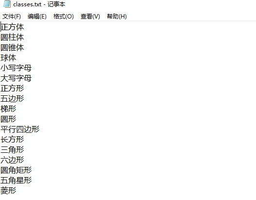

# 声明：本教程只能用于教学目的，如果用于非法目的与本人无关

# --------------- 广告 ---------------

## 本人24个实战视频教程，后续会更新十几个，每个教程都有配套的数据样本，训练代码，成品模型，推测代码，2k出售，有问题可以随时问，详情联系本人：tomysky67


## 试看视频 顶象空间推理.mkv 链接: https://pan.baidu.com/s/1ly-wmD5GMHpwTb2PpF8-ww?pwd=6666 提取码: 6666

# --------------- 广告 ---------------

# 空间推理验证码
# 教程视频讲解地址：https://www.bilibili.com/video/BV1cs7gzZEhD/?vd_source=4e60c6c3075c23c4aef0f545b39459b8
## 1.分析


> ​		需要识别的物体包括立体图像，二维图形，字母大小写及每个物体的颜色属性。首先需要用yolo定位物体位置；接着分类，只分类物体的标签（圆柱体，立方体，圆锥体，球体，大写字母，小写字母，正方形等等），颜色后面可以用rgb通道的数量判断颜色；然后yolo目标检测分类模型；最后paddleocr识别文字，匹配识别模式，根据识别模式在分类标签里找结果，输出结果的坐标中心就完成。

## 2.目标检测



> ​		这是分类名，建议大家以后用中文拼音或者对应的英文。我用中文有时候会出点奇奇怪怪的bug。

**target.yaml**

```yaml
train: train/images # train images (relative to 'path') 128 images
val: val/images # val images (relative to 'path') 128 images

nc: 17
names: ["正方体", "圆柱体", "圆锥体", "球体", "小写字母", "大写字母", "正方形", "五边形", "梯形", "圆形", "平行四边形", "长方形", "三角形", "六边形", "圆角矩形", "五角星形", "菱形"]

```

**train.py**

```python
from ultralytics import YOLO

def train_model():
    # 加载YOLOv8模型
    model = YOLO('yolo11m.pt')  

    # 开始训练
    model.train(
        data='./target.yaml',  # 数据集的配置文件
        epochs=600,                        # 训练的轮数
        imgsz=640,                         # 输入图像的尺寸
        batch=8,                          # 批处理大小
        device='0',                        # 使用的GPU设备编号
        patience=600
          )

    # 评估模型
    model.val()

    # 导出模型
    model.export(format='onnx')  # 你可以选择其他格式，如'onnx', 'coreml', 'tflite', 等等

if __name__ == '__main__':
    import multiprocessing
    multiprocessing.freeze_support()  # 确保在Windows系统上正确启动多进程
    train_model()
```

## 3.加载训练好的模型做预测

> ​		首先用paddleocr识别文字，匹配识别的模式；然后目标检测下面验证码里的目标位置并识别类别(颜色需要rbg三通道占比判断)；最后根据匹配模式找到结果的标签。


**yolo预测代码**

```python
import os
import random
import uuid
import cv2
from tqdm import tqdm
from ultralytics import YOLO

def predict_and_draw_boxes(image_path, model, save_result=False, output_path='output.jpg'):
    # 读取图像
    image = cv2.imread(image_path)
    # image = cv2.resize(image,(640,640))
    if image is None:
        print(f"Error: Image at {image_path} could not be loaded.")
        return

    # 进行预测
    results = model(image)

    # 解析和显示结果
    boxes = results[0].boxes.xyxy  # 获取所有预测框的坐标
    classes = results[0].boxes.cls  # 获取所有预测框的类别
    confidences = results[0].boxes.conf  # 获取所有预测框的置信度

    for i, box in enumerate(boxes):
        x1, y1, x2, y2 = map(int, box)  # 转换为整数坐标

        class_id = int(classes[i].item())  # 类别ID

        confidence = confidences[i].item()  # 置信度
        if confidence<0.5:
            continue
        centre_x = (x1 + x2)/2
        centre_y = (y1 + y2)/2
        print("centre point:",(centre_x,centre_y))
        cv2.rectangle(image, (x1_expanded, y1_expanded), (x2_expanded, y2_expanded), (255, 255, 0), 2)  # 绘制矩形框
        label = f'{model.names[class_id]} {confidence:.2f}'
        cv2.putText(image, label, (x1, y2 + 15), cv2.FONT_HERSHEY_SIMPLEX, 0.5, (255, 0, 0), 2)

    # # 显示结果图像
    cv2.imshow('Prediction', image)
    cv2.waitKey(0)
    cv2.destroyAllWindows()


if __name__ == '__main__':
    model_path = 'best.pt'  # 替换为你的模型路径
    model = YOLO(model_path)
    base_dir = "images"
    files = os.listdir(base_dir)
    for file in tqdm(files):
        filename = os.path.join(base_dir, file)
        print(filename)
        predict_and_draw_boxes(filename, model)

```

**paddleocr识别文字：**

```python
from paddleocr import PaddleOCR
def reg_words(image):
    result = ocr.ocr(image, cls=True)
    # 遍历OCR识别结果，返回第一个识别到的文本
    for res in result:
        for line in res:
            text = line[-1][0]
            return text
    return ""
```

**颜色占比判断代码：**

```python
def get_dominant_color(img):
    """判断图像中红、绿、蓝哪个颜色最多"""
    # img = cv2.imread(image_path)  # 读取图片（BGR格式）
    if img is None:
        return None

    # 计算每个通道的像素总和
    blue_sum = np.sum(img[:, :, 0])  # B通道
    green_sum = np.sum(img[:, :, 1])  # G通道
    red_sum = np.sum(img[:, :, 2])  # R通道

    # 找到最大值对应的颜色
    color_dict = {"红色": red_sum, "绿色": green_sum, "蓝色": blue_sum}
    dominant_color = max(color_dict, key=color_dict.get)

    return dominant_color
```

**模式判断示例：**


```python
#info=(centre_x,centre_y,model.names[class_id],color)
def choose_model(text,infos):
    res_point = (0,0)
    if "请点击大写的字母" in text:
        print("大写字母")
        for info in infos:
            if info[2] == "大写字母":
                res_point = (info[0],info[1])
                break
    elif "请点击平面图形" in text:
        print("请点击平面图形")
        for info in infos:
            if info[2].endswith("形"):
                res_point = (info[0],info[1])
                break
    elif "左侧的" in text:
        index = text.index("左侧的")
        origin = text[3:index]
        target = text[index+3:]
        if origin=="球":
            origin = "球体"
        print(f"origin: {origin}, target: {target}")
        target_points = []
        for info in infos:
            if origin == info[2] or origin in info[2]:
                origin_point = (info[0],info[1])
            elif "字母" in info[2]:
                target_points.append((info[0],info[1]))
        for target_point in target_points:
            if target_point[0] < origin_point[0]:
                res_point = target_point
                break
    elif "与" in text:
        index = text.index("与")
        origin = text[3:index]
        target = text[index+1:-5]
        print(f"origin: {origin}, target: {target}")
        target_color = ""
        for info in infos:
            if target == info[2] or target in info[2]:
                target_color = info[3]
                break
        for info in infos:
            if info[3] == target_color and target not in info[2]:
                res_point = (info[0],info[1])
                break
    ...
    return res_point
```

